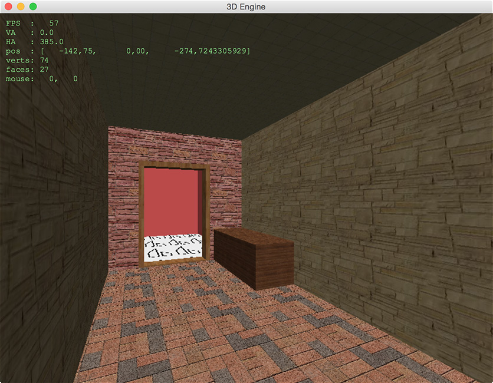

# The3DEngine
3D renderer exercise

On base of 
[demo.design 3D programming FAQ](http://www.enlight.ru/faq3d/main.htm) 
(in russian). 

Additional materials: [Michael Abrash about Quake engine](https://www.bluesnews.com/abrash/), 
included in [Graphics Programming Black Book](http://www.gamedev.net/page/resources/_/technical/graphics-programming-and-theory/graphics-programming-black-book-r1698).

Experiment of building game 3D renderer engine. 
"Levels" can be created with [Sketchup](http://www.sketchup.com)

